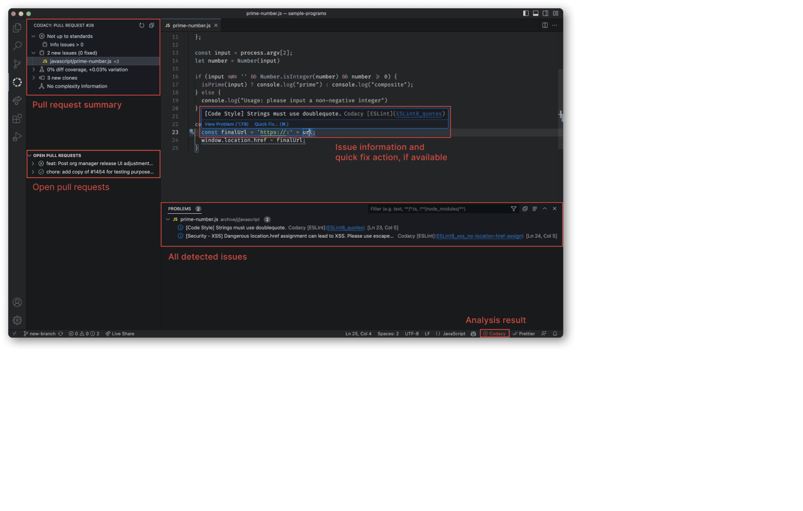

# Codacy Visual Studio Code Extension

The Codacy extension for Visual Studio Code helps you review and manage issues found by Codacy by highlighting problematic code patterns, notifying you whether a pull request is up to standards, and displaying code quality metrics directly within Visual Studio Code.

[Codacy](https://www.codacy.com/) is an automated code review tool that helps your team write high-quality code by analyzing over 40 programming languages, such as PHP, JavaScript, Python, Java, and Ruby. Codacy lets you define and enforce your own quality rules, code patterns, and quality settings to prevent issues in your codebase.

## Prerequisites
1.  You have a [Codacy account](https://www.codacy.com/signup-codacy).
2.  The repository you’re working on has been [added to Codacy Cloud](https://docs.codacy.com/organizations/managing-repositories/#adding-a-repository).
3.  You have at least [Repository Read permissions](https://docs.codacy.com/organizations/roles-and-permissions-for-organizations/) for the repository you’re working on.

## Installation

You can install the extension from within Visual Studio Code (Cmd+Shift+X or Ctrl+Shift+X), or from [the Visual Studio Marketplace](https://marketplace.visualstudio.com/items?itemName=codacy-app.codacy). Alternatively, you can [download the latest version as a VSIX package](https://github.com/codacy/codacy-vscode-extension/releases) and install it manually. 

